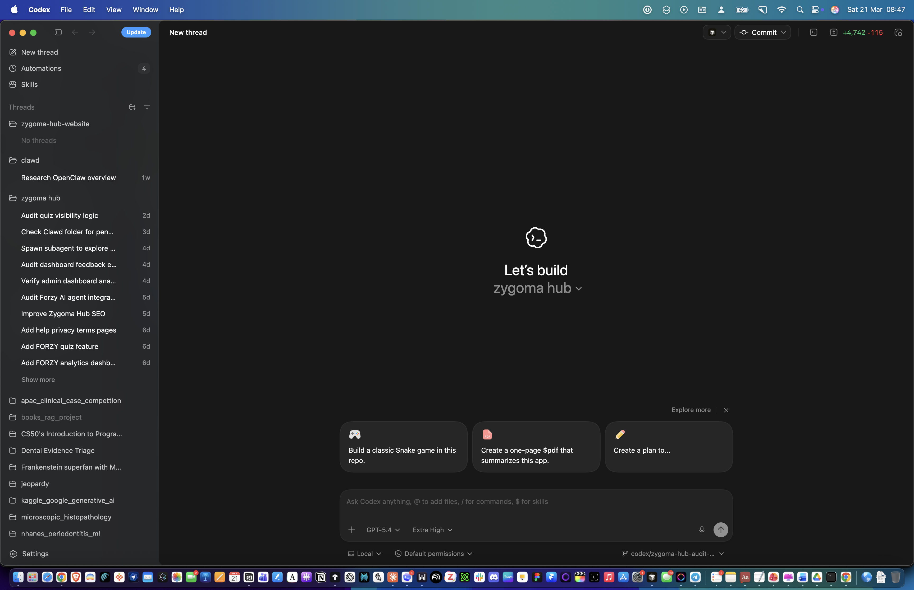
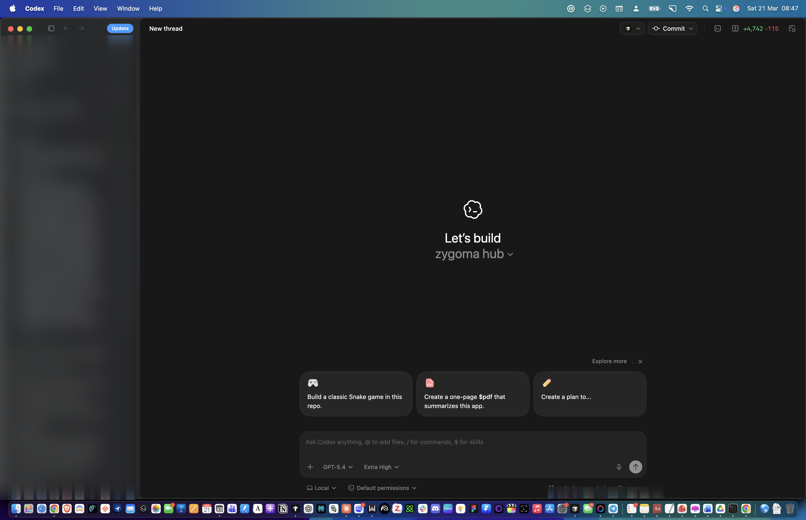
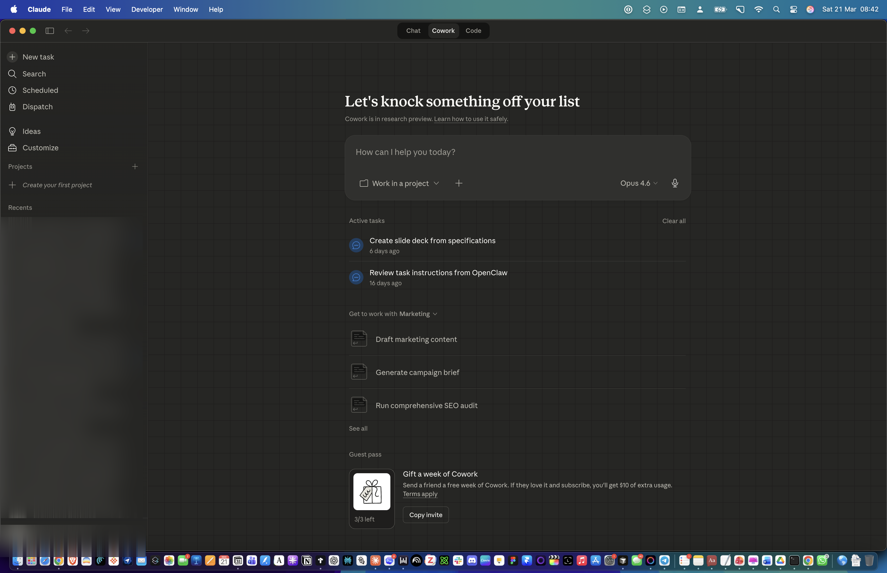
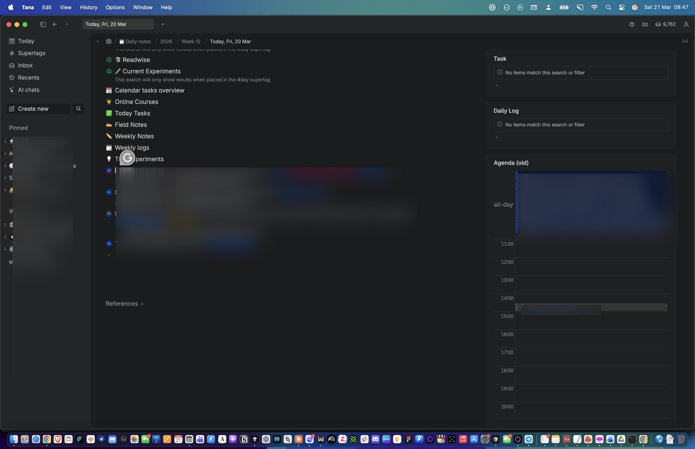

# 🔒 Screenshot Blur Agent

> Take screenshots of desktop apps and automatically blur sensitive information using AI vision + ImageMagick.

Built for AI agents (OpenClaw, Claude Code, Codex) that need to create clean screenshots for tutorials, blog posts, tweets, or documentation without leaking private data.

## The Problem

You want to share a screenshot of your workflow, but it contains:
- Conversation titles with client names
- Personal workspace names
- Email addresses in sidebars
- Meeting titles with people's names
- Project names you haven't announced yet

Manually blurring each area is tedious. Finding the right coordinates is guesswork.

## The Solution

Let an AI vision model find the sensitive areas, then blur them automatically.

```
Screenshot → Vision Model → Coordinates → ImageMagick Blur → Verify
```

### Before & After

**Codex** - Project list and conversation history blurred:

| Before | After |
|--------|-------|
|  |  |

**Claude Desktop** - Sidebar conversations blurred:



**Tana** - Meeting titles, personal names, and calendar events blurred:



## How It Works

### 1. Capture

```bash
# Bring app to front and screenshot (macOS)
bash scripts/capture-electron.sh "Claude" /tmp/claude.png
```

### 2. Identify (AI Vision)

Send the screenshot to any vision model with this prompt:

> "Identify all areas containing sensitive or private information (personal names, conversation titles, email addresses, project names). Return pixel coordinates (x, y, width, height). The image is Retina resolution."

The model returns coordinates like:
```
Sidebar conversations: x=0, y=335, w=220, h=465 (display scale)
User identity: x=0, y=810, w=225, h=50
```

### 3. Scale for Retina

```bash
# Check actual dimensions
identify screenshot.png  # → 3456x2234

# Display scale was ~1368x880
# Scale factor: 3456/1368 = 2.526x
# Multiply all coordinates by 2.526
```

### 4. Blur

```bash
bash scripts/blur.sh screenshot.png blurred.png 0 846 556 1174 40
bash scripts/blur.sh blurred.png final.png 0 2046 568 126 40
```

### 5. Verify

Send the blurred image back to the vision model:

> "Can you read any personal names, conversation titles, or private data?"

If it reports any readable sensitive text, adjust coordinates and re-blur.

## Supported Apps

Works with any macOS app. Tested with these Electron apps:

| App | What to blur |
|-----|-------------|
| **Claude** | Sidebar conversations, user identity |
| **Codex** | Project list, thread history, repo paths |
| **Tana** | Node names, meeting titles, calendar events |
| **Slack** | Channel names, DM conversations |
| **VS Code** | File tree, terminal output |

### Electron CDP (Advanced)

For viewport-only screenshots (no dock/menubar), connect via Chrome DevTools Protocol:

```bash
# Relaunch with CDP
open -a "Tana" --args --remote-debugging-port=9228

# Take screenshot via CDP (Playwright, Puppeteer, or agent-browser)
```

## Requirements

- **macOS** (for `screencapture` + `osascript`)
- **ImageMagick 7+**: `brew install imagemagick`
- **AI vision model** (any: Claude, GPT-4o, Gemini)
- **OpenClaw** (optional, for full agent automation)

## As an OpenClaw Skill

Drop this repo into your skills directory:

```bash
cd ~/clawd/skills
git clone https://github.com/Tuminha/screenshot-blur-agent.git
```

Then your agent can use it automatically when creating tutorials or sharing screenshots.

## Tips

- **Blur strength 40** makes text unreadable to both humans and AI models
- **Chain blur operations** one region at a time (avoids ImageMagick timeouts on large Retina images)
- **Always verify** with a vision model after blurring
- Vision models sometimes report coordinates slightly off. Iterate if needed.
- For non-macOS: replace `screencapture` with your platform's screenshot tool. The blur logic works everywhere ImageMagick runs.

## License

MIT

## Credits

Built by [@Cisco_research](https://x.com/Cisco_research) with [OpenClaw](https://github.com/openclaw/openclaw).
